# AWS VPC (Virtual Private Cloud) — Complete Guide & Deep Dive Reference

[](LICENSE)
[](https://aws.amazon.com/vpc/)
[](#table-of-contents)

A comprehensive AWS networking reference covering **Amazon VPC** from first principles to production architecture. Includes **18 in-depth sections**, **8 architecture diagrams**, comparison tables, and real configuration examples — everything you need to understand, design, and operate AWS VPC networking.

**Topics covered:** VPC subnets · Route Tables · Internet Gateway · NAT Gateway · Security Groups · Network ACLs · VPC Endpoints (PrivateLink) · VPC Peering · Transit Gateway · Site-to-Site VPN · AWS Direct Connect · Flow Logs · Route 53 Resolver · High Availability design · CIDR planning

> Useful for: AWS Solutions Architect Associate / Professional exam prep, cloud engineers designing production VPCs, developers learning AWS networking, and DevOps teams building multi-account architectures.

---

## Who Is This For?

| Audience | How this helps |
|----------|----------------|
| **AWS Beginners** | Learn what a VPC is, how subnets work, and how traffic flows end-to-end |
| **Solutions Architects** | Reference for every networking component: peering, TGW, DX, PrivateLink |
| **Certification Prep** | Covers every VPC topic in the SAA-C03 and SAP-C02 exam blueprints |
| **DevOps / Platform Engineers** | Practical patterns: HA NAT, multi-AZ design, hybrid connectivity |
| **Security Engineers** | Deep coverage of Security Groups, NACLs, VPC Flow Logs, and endpoint policies |

---

## Table of Contents

1. [Overview](#1-overview)
2. [Subnets](#2-subnets)
3. [Route Tables](#3-route-tables)
4. [Internet Gateway (IGW)](#4-internet-gateway-igw)
5. [NAT Gateway & NAT Instance](#5-nat-gateway--nat-instance)
6. [Security Groups](#6-security-groups)
7. [Network ACLs (NACLs)](#7-network-acls-nacls)
8. [VPC Endpoints & PrivateLink](#8-vpc-endpoints--privatelink)
9. [VPC Peering](#9-vpc-peering)
10. [AWS Transit Gateway (TGW)](#10-aws-transit-gateway-tgw)
11. [VPN Connections](#11-vpn-connections)
12. [AWS Direct Connect (DX)](#12-aws-direct-connect-dx)
13. [Elastic Network Interfaces (ENIs)](#13-elastic-network-interfaces-enis)
14. [Elastic IPs (EIPs)](#14-elastic-ips-eips)
15. [VPC Flow Logs](#15-vpc-flow-logs)
16. [DNS in VPC](#16-dns-in-vpc)
17. [High Availability & Multi-AZ Architecture](#17-high-availability--multi-az-architecture)
18. [CIDR Planning Cheat Sheet](#18-cidr-planning-cheat-sheet)
19. [Prefix Lists](#19-prefix-lists)
20. [AWS Network Firewall](#20-aws-network-firewall)
21. [Gateway Load Balancer (GWLB)](#21-gateway-load-balancer-gwlb)
22. [Traffic Mirroring](#22-traffic-mirroring)
23. [VPC Lattice](#23-vpc-lattice)
24. [Enhanced Networking & MTU](#24-enhanced-networking--mtu)
25. [VPC Sharing via RAM](#25-vpc-sharing-via-ram)

---

## 1. Overview

### What is a VPC?

An **Amazon Virtual Private Cloud (VPC)** is a logically isolated section of the AWS cloud where you launch AWS resources in a virtual network that you define. It gives you complete control over:

- IP address ranges (CIDR blocks)
- Subnet layout (public / private / isolated)
- Route tables and network gateways
- Security at both instance and subnet levels
- Connectivity to the internet, other VPCs, and on-premises networks

Think of a VPC as your own private data center network — but running on AWS infrastructure, without hardware to manage.

```
┌─────────────────────────────────────────────────────────────────────┐
│                         AWS Region (us-east-1)                      │
│                                                                     │
│  ┌──────────────────────────────────────────────────────────────┐   │
│  │                    Your VPC (10.0.0.0/16)                    │   │
│  │                                                              │   │
│  │   ┌──────────────────────┐  ┌──────────────────────────┐    │   │
│  │   │  AZ-A (us-east-1a)   │  │   AZ-B (us-east-1b)      │    │   │
│  │   │  ┌────────────────┐  │  │  ┌────────────────────┐   │    │   │
│  │   │  │ Public Subnet  │  │  │  │  Public Subnet     │   │    │   │
│  │   │  │  10.0.1.0/24   │  │  │  │   10.0.2.0/24      │   │    │   │
│  │   │  └────────────────┘  │  │  └────────────────────┘   │    │   │
│  │   │  ┌────────────────┐  │  │  ┌────────────────────┐   │    │   │
│  │   │  │ Private Subnet │  │  │  │  Private Subnet    │   │    │   │
│  │   │  │  10.0.11.0/24  │  │  │  │   10.0.12.0/24     │   │    │   │
│  │   │  └────────────────┘  │  │  └────────────────────┘   │    │   │
│  │   └──────────────────────┘  └──────────────────────────┘    │   │
│  └──────────────────────────────────────────────────────────────┘   │
└─────────────────────────────────────────────────────────────────────┘
```

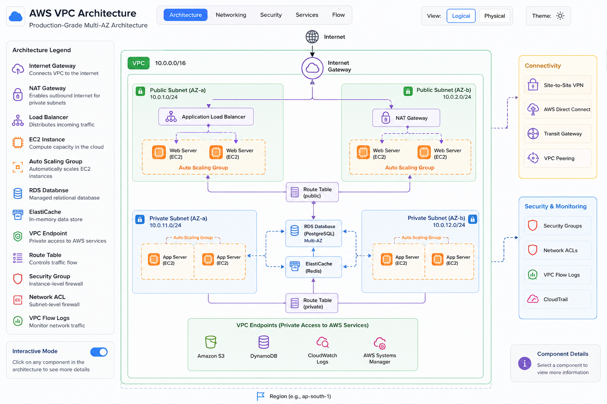

### Default VPC vs Custom VPC

| Feature                        | Default VPC              | Custom VPC                          |
|-------------------------------|--------------------------|-------------------------------------|
| Created by                    | AWS automatically        | You                                 |
| CIDR block                    | 172.31.0.0/16 (fixed)   | Any RFC 1918 range you choose       |
| Subnets                       | One public per AZ        | You design the layout               |
| Internet Gateway              | Attached automatically   | You attach it                       |
| Route to internet             | Already in main route table | You add it                       |
| DNS hostnames                 | Enabled                  | Disabled by default                 |
| Best for                      | Quick experiments, demos | All production workloads            |

> **Recommendation:** Never use the Default VPC for production. Always create a custom VPC with a deliberate IP plan.

### IPv4 and IPv6 CIDR Rules

**IPv4:**
- VPC CIDR: `/16` to `/28` (AWS minimum is /28, maximum is /16)
- Cannot be changed after creation (you can *add* secondary CIDRs, not replace the primary)
- Allowed ranges: RFC 1918 private space (`10.0.0.0/8`, `172.16.0.0/12`, `192.168.0.0/16`)
- You can also use public CIDRs you own (BYOIP)

**IPv6:**
- AWS assigns a `/56` block from Amazon's pool (or you can use BYOIP IPv6)
- Each subnet gets a `/64`
- All IPv6 addresses are globally unique (no private IPv6 in VPC)

---

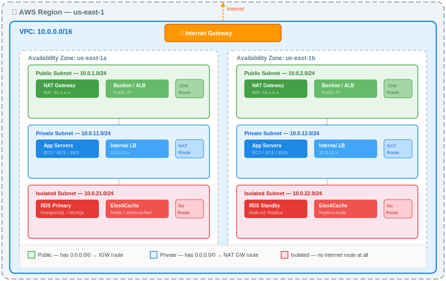

## 2. Subnets

A **subnet** is a range of IP addresses within your VPC, confined to a single Availability Zone. Every resource you launch (EC2, RDS, Lambda in VPC, etc.) lives in a subnet.

### Types of Subnets

| Type      | Has route to IGW? | Has route to NAT GW? | Use case                            |
|-----------|-------------------|----------------------|-------------------------------------|
| Public    | Yes               | Not needed           | Load balancers, bastion hosts, NAT GW |
| Private   | No                | Yes (for egress)     | App servers, EKS nodes, caches       |
| Isolated  | No                | No                   | Databases, internal services with no egress |

### Subnet Layout Diagram

```
VPC: 10.0.0.0/16
│
├── AZ: us-east-1a
│   ├── Public Subnet:   10.0.1.0/24   (256 IPs → 251 usable)
│   ├── Private Subnet:  10.0.11.0/24
│   └── Isolated Subnet: 10.0.21.0/24
│
├── AZ: us-east-1b
│   ├── Public Subnet:   10.0.2.0/24
│   ├── Private Subnet:  10.0.12.0/24
│   └── Isolated Subnet: 10.0.22.0/24
│
└── AZ: us-east-1c
    ├── Public Subnet:   10.0.3.0/24
    ├── Private Subnet:  10.0.13.0/24
    └── Isolated Subnet: 10.0.23.0/24
```

### Reserved IP Addresses (5 per subnet)

For every subnet, AWS reserves the first 4 IPs and the last 1 IP. In a `/24` (256 total):

| Address       | Reserved for                         |
|---------------|--------------------------------------|
| 10.0.1.0      | Network address                      |
| 10.0.1.1      | VPC router                           |
| 10.0.1.2      | Amazon DNS                           |
| 10.0.1.3      | Reserved for future use              |
| 10.0.1.255    | Broadcast (not supported, reserved)  |

So a `/24` gives you **251 usable IPs**, a `/28` gives you only **11 usable IPs**.

### Key Subnet Settings

- **Auto-assign public IPv4**: When enabled, every instance launched in the subnet automatically gets a public IP (ephemeral — released when instance stops). Enable on public subnets.
- **Auto-assign IPv6**: Assigns an IPv6 address from the subnet's `/64` block.
- **Default subnet**: Behavior similar to subnets in the Default VPC.

---

## 3. Route Tables

A **route table** contains a set of rules (routes) that determine where network traffic is directed. Every subnet must be associated with exactly one route table.

### Main Route Table vs Custom Route Tables

- The **main route table** is created automatically with the VPC. All subnets not explicitly associated with a custom route table use it.
- **Custom route tables** let you control routing per subnet tier (public, private, isolated).
- Best practice: never add routes to the main route table — create separate tables per tier.

### The Local Route

Every route table always contains a **local route** that cannot be removed:

```
Destination     Target
10.0.0.0/16     local
```

This route enables all resources within the VPC to communicate with each other regardless of subnet.

### Common Route Table Configurations

**Public Subnet Route Table:**
```
Destination       Target
10.0.0.0/16       local
0.0.0.0/0         igw-xxxxxxxx     ← Internet Gateway
```

**Private Subnet Route Table (with NAT):**
```
Destination       Target
10.0.0.0/16       local
0.0.0.0/0         nat-xxxxxxxx     ← NAT Gateway (in public subnet)
```

**Isolated Subnet Route Table:**
```
Destination       Target
10.0.0.0/16       local
                  (nothing else)
```

**With VPC Peering:**
```
Destination       Target
10.0.0.0/16       local
10.1.0.0/16       pcx-xxxxxxxx     ← Peering connection to VPC-B
0.0.0.0/0         igw-xxxxxxxx
```

### Route Priority (Longest Prefix Match)

AWS always chooses the most specific route (longest prefix). A route to `10.0.1.0/24` takes priority over `10.0.0.0/16` for traffic destined to `10.0.1.5`.

### Subnet-to-Route-Table Association

```
                    ┌──────────────────────────────────────┐
                    │  Public RT                           │
 Public Subnet A ───┤  10.0.0.0/16 → local                │
 Public Subnet B ───┤  0.0.0.0/0   → igw-xxx              │
                    └──────────────────────────────────────┘

                    ┌──────────────────────────────────────┐
                    │  Private RT (AZ-A)                   │
 Private Subnet A ──┤  10.0.0.0/16 → local                │
                    │  0.0.0.0/0   → nat-gw-az-a          │
                    └──────────────────────────────────────┘

                    ┌──────────────────────────────────────┐
                    │  Private RT (AZ-B)                   │
 Private Subnet B ──┤  10.0.0.0/16 → local                │
                    │  0.0.0.0/0   → nat-gw-az-b          │
                    └──────────────────────────────────────┘
```

---

## 4. Internet Gateway (IGW)

An **Internet Gateway** is a horizontally scaled, redundant, highly available VPC component that allows communication between your VPC and the internet.

### Key Facts

- One IGW per VPC (1:1 relationship)
- Fully managed by AWS — no bandwidth bottleneck, no single point of failure
- Performs **NAT** for instances with public IPv4 addresses (translates between private and public IPs)
- For IPv6, IGW routes packets directly (no NAT needed — IPv6 is publicly routable)

### Requirements for an Instance to Reach the Internet

All three must be true:
1. Subnet has a route `0.0.0.0/0 → igw-xxx`
2. The instance has a public IPv4 (or EIP) assigned to its ENI
3. Security group allows the outbound traffic

### Traffic Flow — Public EC2 to Internet

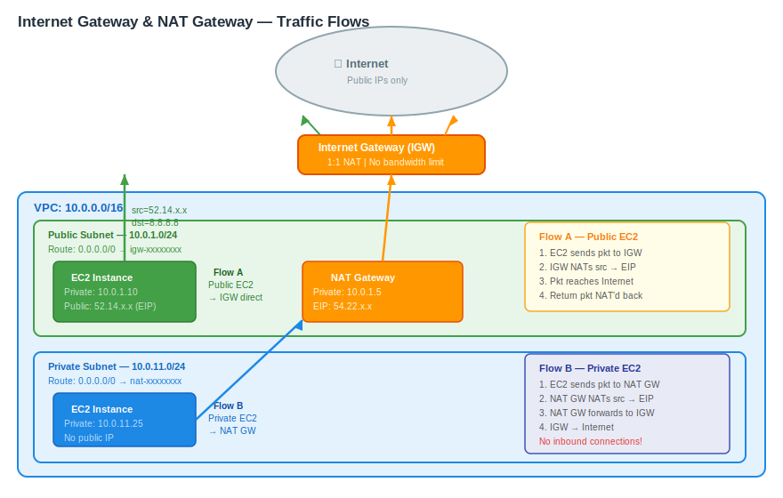

```
   ┌─────────────────────────────────────────────────────────────┐
   │  VPC (10.0.0.0/16)                                          │
   │                                                             │
   │  Public Subnet (10.0.1.0/24)                               │
   │  ┌──────────────────────┐                                  │
   │  │  EC2 Instance        │                                  │
   │  │  Private: 10.0.1.10  │                                  │
   │  │  Public:  54.x.x.x   │                                  │
   │  └──────────┬───────────┘                                  │
   │             │ (packet: src=10.0.1.10, dst=8.8.8.8)         │
   │             ▼                                              │
   │  ┌──────────────────────┐                                  │
   │  │  Internet Gateway    │  ← translates src to 54.x.x.x   │
   │  └──────────┬───────────┘                                  │
   └─────────────┼───────────────────────────────────────────── ┘
                 │
                 ▼
            [ Internet ]
                 │
       (return traffic: dst=54.x.x.x)
                 │
                 ▼
   IGW translates dst back to 10.0.1.10
```

### Egress-Only Internet Gateway (for IPv6)

- Allows outbound IPv6 traffic from the VPC to the internet
- **Stateful**: allows return traffic automatically
- Prevents inbound IPv6 connections from the internet
- Use this on private subnets with IPv6 (analogous to NAT GW for IPv4)

---

## 5. NAT Gateway & NAT Instance

Private subnet instances need outbound internet access (for OS patches, API calls, etc.) without being directly reachable from the internet. **NAT** (Network Address Translation) solves this.

### NAT Gateway (Managed)

- Deployed into a **public subnet** with an **Elastic IP**
- AWS-managed: no patching, auto-scales up to 100 Gbps
- **Billing**: hourly charge (~$0.045/hr) + per-GB data processed (~$0.045/GB)
- Not free tier eligible
- **AZ-scoped**: one NAT GW per AZ for high availability

### NAT Instance (Self-Managed)

- An EC2 instance with the `amzn-ami-vpc-nat` AMI
- You must disable **source/destination check** on the instance
- Single point of failure unless you script failover
- Cheaper for low-traffic workloads; t3.nano can handle ~1 Gbps
- Full control: can run as a bastion, proxy, or VPN endpoint too

### NAT Gateway Traffic Flow

```
   ┌──────────────────────────────────────────────────────────────────┐
   │  VPC (10.0.0.0/16)                                               │
   │                                                                  │
   │  Private Subnet (10.0.11.0/24)       Public Subnet (10.0.1.0/24)│
   │  ┌──────────────────┐               ┌──────────────────────────┐ │
   │  │  EC2 (App)       │               │  NAT Gateway             │ │
   │  │  10.0.11.25      │──────────────►│  Private: 10.0.1.5       │ │
   │  │                  │◄──────────────│  EIP:     52.x.x.x       │ │
   │  └──────────────────┘               └──────────┬───────────────┘ │
   │                                                │                 │
   └────────────────────────────────────────────────┼─────────────────┘
                                                    │
                                           ┌────────▼────────┐
                                           │ Internet Gateway │
                                           └────────┬────────┘
                                                    │
                                               [ Internet ]
```

### High Availability NAT Pattern

For true HA, deploy one NAT GW per AZ and give each AZ's private subnet its own route table pointing to its local NAT GW:

```
AZ-A Private Subnet → Private RT-A → NAT GW-A (in AZ-A public subnet)
AZ-B Private Subnet → Private RT-B → NAT GW-B (in AZ-B public subnet)
```

If AZ-A fails, AZ-B traffic is unaffected. If you use a single NAT GW and its AZ fails, all private subnets lose internet access.

### Comparison

| Feature               | NAT Gateway          | NAT Instance              |
|-----------------------|----------------------|---------------------------|
| Availability          | Managed by AWS       | You manage HA             |
| Bandwidth             | Up to 100 Gbps       | Limited by instance size  |
| Maintenance           | None                 | OS patching, monitoring   |
| Cost (low traffic)    | Higher (~$33/mo)     | Lower (t3.nano ~$4/mo)    |
| Security groups       | Not applicable       | Fully configurable        |
| Port forwarding       | No                   | Yes                       |
| Bastion host          | No                   | Yes (can combine roles)   |

---

## 6. Security Groups

A **Security Group (SG)** acts as a virtual stateful firewall for your EC2 instances and other resources (RDS, Lambda, ELB, etc.). It operates at the **ENI (instance) level**.

### Core Characteristics

- **Stateful**: if you allow inbound traffic on port 443, the return traffic is automatically allowed — no need for an explicit outbound rule.
- **Allow-only**: you can only write allow rules. There is no explicit deny. All traffic not matched by an allow rule is **implicitly denied**.
- **Multiple SGs**: an instance can have up to 5 security groups (soft limit, adjustable).
- **Applied to ENIs**: technically SGs attach to network interfaces, not instances.

### Default Security Group

Every VPC has a default SG. Its initial rules:
- Inbound: allow all traffic from other resources also using the default SG
- Outbound: allow all traffic to anywhere

> **Best practice**: never use the default SG. Create purpose-specific SGs.

### Security Group Chaining (Reference by SG ID)

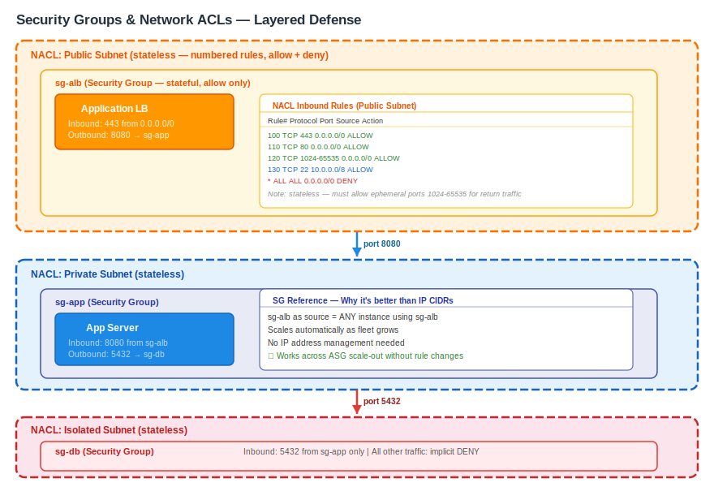

Instead of specifying IP CIDR ranges, you can reference another SG as the source/destination. This is far more maintainable — as instances scale out or IP addresses change, the rule stays correct.

```
┌──────────────────────────────────────────────────────────────────┐
│  SG: sg-alb (Application Load Balancer)                          │
│  Inbound:  0.0.0.0/0 on port 443                                 │
│  Outbound: sg-app on port 8080                                   │
└────────────────────────────┬─────────────────────────────────────┘
                             │
                             ▼
┌──────────────────────────────────────────────────────────────────┐
│  SG: sg-app (Application Servers)                                │
│  Inbound:  sg-alb on port 8080                                   │
│  Outbound: sg-db on port 5432                                    │
└────────────────────────────┬─────────────────────────────────────┘
                             │
                             ▼
┌──────────────────────────────────────────────────────────────────┐
│  SG: sg-db (Database Servers)                                    │
│  Inbound:  sg-app on port 5432                                   │
│  Outbound: (none needed — stateful return handled automatically) │
└──────────────────────────────────────────────────────────────────┘
```

### Example Security Group Rules

**ALB Security Group:**
| Direction | Protocol | Port | Source        |
|-----------|----------|------|---------------|
| Inbound   | TCP      | 80   | 0.0.0.0/0     |
| Inbound   | TCP      | 443  | 0.0.0.0/0     |
| Outbound  | All      | All  | 0.0.0.0/0     |

**App Server Security Group:**
| Direction | Protocol | Port | Source/Dest   |
|-----------|----------|------|---------------|
| Inbound   | TCP      | 8080 | sg-alb        |
| Inbound   | TCP      | 22   | sg-bastion    |
| Outbound  | All      | All  | 0.0.0.0/0     |

**Database Security Group:**
| Direction | Protocol | Port | Source        |
|-----------|----------|------|---------------|
| Inbound   | TCP      | 5432 | sg-app        |
| Outbound  | All      | All  | 0.0.0.0/0     |

---

## 7. Network ACLs (NACLs)

A **Network Access Control List (NACL)** is a stateless firewall applied at the **subnet boundary**. It controls traffic entering and leaving the subnet.

### Core Characteristics

- **Stateless**: return traffic must be explicitly allowed. If you allow inbound TCP/443, you must also allow outbound TCP on the ephemeral port range (1024–65535).
- **Numbered rules**: rules are evaluated lowest number first. First match wins.
- **Allow and Deny**: unlike SGs, NACLs support explicit deny rules.
- **One NACL per subnet**: each subnet is associated with exactly one NACL.
- **Default NACL**: allows all inbound and outbound traffic.

### Ephemeral Ports

When a client initiates a TCP connection, the OS picks a random **ephemeral (source) port** in the range:
- Linux: `32768–60999`
- Windows: `49152–65535`
- AWS recommends covering `1024–65535` to be safe

Your NACL outbound rules must allow this range to permit return traffic for inbound connections.

### Example NACL (Public Subnet)

**Inbound Rules:**
| Rule # | Type       | Protocol | Port Range  | Source       | Allow/Deny |
|--------|------------|----------|-------------|--------------|------------|
| 100    | HTTPS      | TCP      | 443         | 0.0.0.0/0    | ALLOW      |
| 110    | HTTP       | TCP      | 80          | 0.0.0.0/0    | ALLOW      |
| 120    | Custom TCP | TCP      | 1024-65535  | 0.0.0.0/0    | ALLOW      |
| 130    | SSH        | TCP      | 22          | 10.0.0.0/8   | ALLOW      |
| *      | All        | All      | All         | 0.0.0.0/0    | DENY       |

**Outbound Rules:**
| Rule # | Type       | Protocol | Port Range  | Destination  | Allow/Deny |
|--------|------------|----------|-------------|--------------|------------|
| 100    | HTTPS      | TCP      | 443         | 0.0.0.0/0    | ALLOW      |
| 110    | HTTP       | TCP      | 80          | 0.0.0.0/0    | ALLOW      |
| 120    | Custom TCP | TCP      | 1024-65535  | 0.0.0.0/0    | ALLOW      |
| *      | All        | All      | All         | 0.0.0.0/0    | DENY       |

### Security Groups vs NACLs — Side-by-Side

| Feature               | Security Group               | NACL                            |
|-----------------------|------------------------------|---------------------------------|
| Level                 | Instance (ENI)               | Subnet                          |
| State                 | Stateful                     | Stateless                       |
| Rules                 | Allow only                   | Allow + Deny                    |
| Rule evaluation       | All rules evaluated          | Lowest rule number first        |
| Return traffic        | Automatically allowed        | Must be explicitly allowed      |
| Scope                 | Per resource                 | Per subnet                      |
| Default behavior      | Deny all inbound             | Allow all (default NACL)        |
| Use case              | Micro-segmentation           | Subnet-level broad blocking     |

> **Best practice**: Use Security Groups as your primary control layer. Use NACLs only for broad subnet-level blocks (e.g., blocking a specific IP range across the entire subnet tier).

---

## 8. VPC Endpoints & PrivateLink

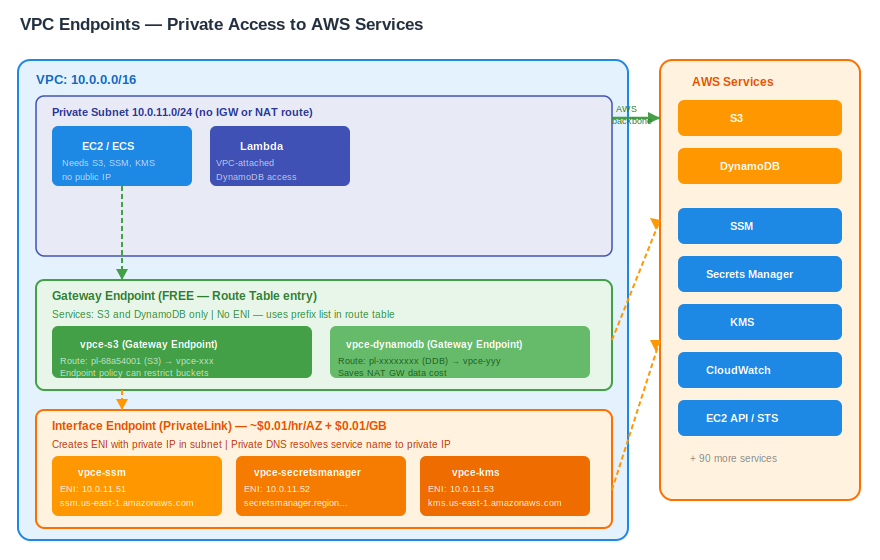

A **VPC Endpoint** lets resources inside your VPC privately connect to supported AWS services **without** leaving the Amazon network — no Internet Gateway, NAT device, VPN, or Direct Connect required.

### Gateway Endpoints

- **Services**: Amazon S3 and Amazon DynamoDB only
- **Free** — no hourly charge
- Works via a route table entry pointing to the endpoint
- Traffic never leaves the AWS network
- Endpoint policies can restrict which S3 buckets or DynamoDB tables are accessible

```
Route Table Entry Added Automatically:
Destination         Target
pl-xxxxxxxx (S3)    vpce-xxxxxxxx
```

```
Private Subnet EC2 ──── [VPC local route] ──── S3 Gateway Endpoint ──── S3
                             (no NAT, no IGW)
```

### Interface Endpoints (AWS PrivateLink)

- **Services**: 100+ AWS services (EC2 API, SSM, Secrets Manager, KMS, SNS, SQS, Kinesis, CloudWatch, and many more)
- Creates an **ENI with a private IP** in your subnet
- **Billed**: ~$0.01/hr per AZ + data processing per GB
- Supports endpoint policies
- Supports **Private DNS**: when enabled, the service's standard DNS name (e.g., `ec2.us-east-1.amazonaws.com`) resolves to the private IP — no code changes needed

```
   ┌─────────────────────────────────────────────────────────────────┐
   │  VPC (10.0.0.0/16)                                              │
   │                                                                 │
   │  Private Subnet                                                 │
   │  ┌──────────────────────┐                                      │
   │  │  EC2 / Lambda / ECS  │                                      │
   │  └──────────┬───────────┘                                      │
   │             │                                                   │
   │             ▼                                                   │
   │  ┌──────────────────────────────────────────────────────────┐  │
   │  │  Interface Endpoint (ENI: 10.0.11.50)                    │  │
   │  │  DNS: ssm.us-east-1.amazonaws.com → 10.0.11.50           │  │
   │  └──────────────────────────────────────────────────────────┘  │
   │             │                                                   │
   └─────────────┼───────────────────────────────────────────────── ┘
                 │ (stays on AWS private backbone)
                 ▼
          [ AWS SSM Service ]
          (never touches internet)
```

### When to Use Which

| Situation                              | Use                          |
|----------------------------------------|------------------------------|
| Private access to S3 or DynamoDB       | Gateway Endpoint (free)      |
| Private access to any other AWS service| Interface Endpoint           |
| Share your own service with other VPCs | PrivateLink Endpoint Service |
| Reduce NAT GW data costs for S3        | Gateway Endpoint             |

### PrivateLink — Publishing Your Own Endpoint Service

You can expose **your own service** (backed by an NLB or GWLB) to other VPCs or AWS accounts privately via PrivateLink — without VPC peering, TGW, or exposing anything to the internet.

**How it works:**
1. Deploy your service behind a **Network Load Balancer (NLB)** in your VPC
2. Create a **VPC Endpoint Service** attached to that NLB
3. Share the service name (e.g. `com.amazonaws.vpce.us-east-1.vpce-svc-xxxxxxxx`) with consumers
4. Consumers create an **Interface Endpoint** in their own VPC pointing to your service
5. Traffic flows privately over AWS backbone — never leaves AWS network

```
Consumer VPC                        Provider VPC
┌──────────────────────┐            ┌──────────────────────────────────┐
│  EC2 / App           │            │  Your Application                │
│  10.0.1.10           │            │  (EC2 / ECS / EKS)              │
│         │            │            │         │                        │
│         ▼            │            │         ▼                        │
│  Interface Endpoint  │            │  Network Load Balancer           │
│  (ENI: 10.0.1.50)   │◄──────────►│  (internal)                      │
│  Private DNS resolves│  AWS       │         │                        │
│  to endpoint IP      │  backbone  │  VPC Endpoint Service            │
└──────────────────────┘            │  (com.amazonaws.vpce...)         │
                                    └──────────────────────────────────┘
```

**Key properties:**
- Provider controls access via **allowlist** (specific AWS account IDs or IAM principals)
- Consumer VPCs can be in **different accounts or regions** (same-region only for PrivateLink)
- No CIDR overlap restriction — consumers only get an ENI IP, not full VPC routing
- Used by AWS itself to deliver all Interface Endpoint services

---

## 9. VPC Peering

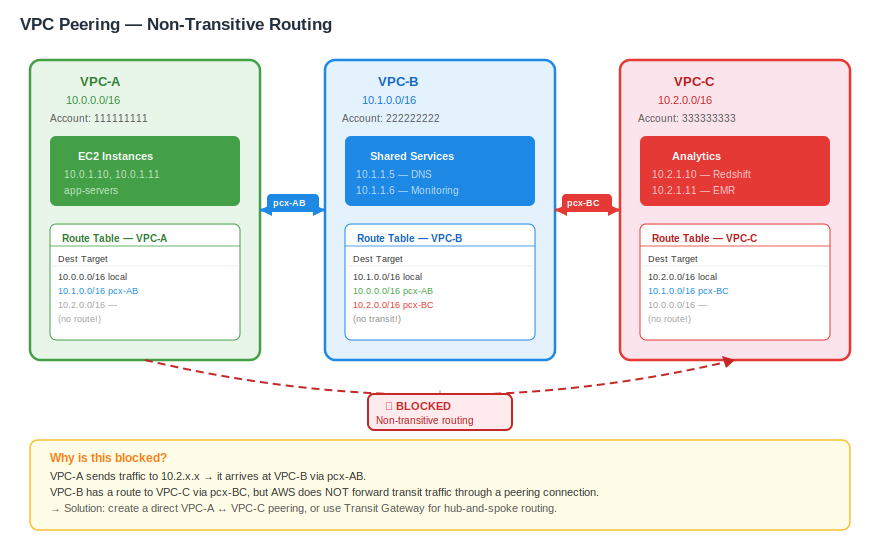

**VPC Peering** creates a private, one-to-one networking connection between two VPCs. Traffic stays on the AWS backbone and never traverses the public internet.

### Key Characteristics

- **Non-transitive**: if VPC-A is peered with VPC-B, and VPC-B is peered with VPC-C, VPC-A cannot talk to VPC-C through VPC-B. You'd need a direct A↔C peering.
- **No overlapping CIDRs**: the CIDR blocks of the two VPCs cannot overlap.
- Works within a region, across regions, and across AWS accounts.
- After creating the peering connection, you must add routes on **both sides**.

### Transitive Routing Limitation

```
VPC-A (10.0.0.0/16)  ←──pcx-AB──→  VPC-B (10.1.0.0/16)
                                           │
                                        pcx-BC
                                           │
                                    VPC-C (10.2.0.0/16)

VPC-A CANNOT reach VPC-C via VPC-B.
Traffic from A destined for 10.2.x.x arrives at B
but B will NOT forward it to C — peering is not transitive.
```

### Route Table Changes Required

**VPC-A Route Table (to reach VPC-B):**
```
10.1.0.0/16    pcx-AB
```

**VPC-B Route Table (to reach VPC-A):**
```
10.0.0.0/16    pcx-AB
```

### Full Mesh vs Transit Gateway

For N VPCs, full-mesh peering requires `N*(N-1)/2` connections:

| VPCs | Peering connections needed |
|------|---------------------------|
| 2    | 1                         |
| 5    | 10                        |
| 10   | 45                        |
| 20   | 190                       |

At scale, use **Transit Gateway** instead (Section 10).

### DNS Resolution Across Peering

By default, DNS hostnames of peered VPC instances resolve to their public IP (if any). To resolve to private IPs across the peering:
- Enable **DNS resolution from accepter VPC** on the peering connection
- Both sides must have `enableDnsSupport = true`

---

## 10. AWS Transit Gateway (TGW)

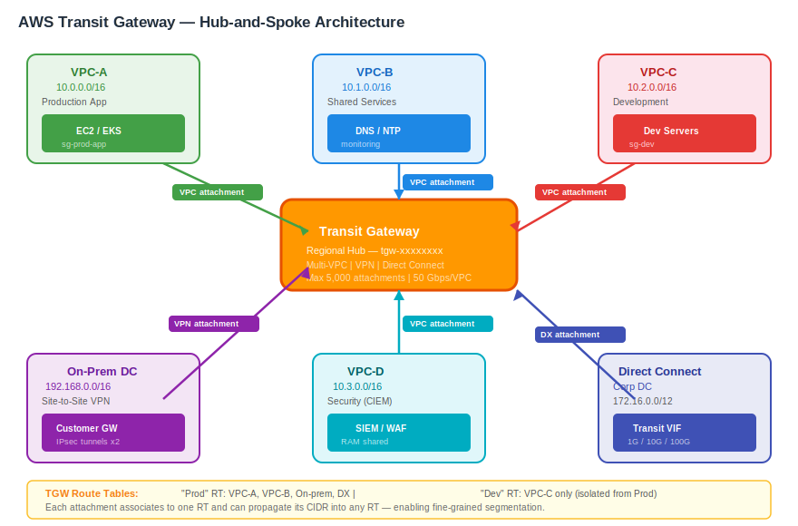

**AWS Transit Gateway** is a regional hub that interconnects VPCs, VPNs, and Direct Connect in a hub-and-spoke model. It eliminates the full-mesh complexity of VPC peering at scale.

### Architecture

```
                          ┌──────────────────────┐
             ┌────────────│   Transit Gateway     │────────────┐
             │            │   (TGW-hub)           │            │
             │            └──────────┬────────────┘            │
             │                       │                         │
        ┌────┴────┐             ┌────┴────┐              ┌─────┴────┐
        │  VPC-A  │             │  VPC-B  │              │  VPC-C   │
        │(10.0/16)│             │(10.1/16)│              │(10.2/16) │
        └─────────┘             └─────────┘              └──────────┘
             │                                                 │
        ┌────┴────┐                                    ┌───────┴──────┐
        │  VPN    │                                    │ Direct       │
        │ (On-prem│                                    │ Connect      │
        │  DC)    │                                    │ (On-prem DC) │
        └─────────┘                                    └──────────────┘
```

### TGW Concepts

**Attachment**: a connection from a VPC, VPN, DX, or another TGW to the Transit Gateway.

**TGW Route Table**: the routing brain of TGW. A TGW can have multiple route tables, allowing you to segment traffic (e.g., prod VPCs cannot route to dev VPCs).

**Association**: each attachment is associated with one TGW route table (determines which routes the attachment can use).

**Propagation**: an attachment can automatically propagate its CIDR into a TGW route table.

### Example: Isolated VPC Routing

```
TGW Route Table: "Prod"
  10.0.0.0/16 → vpc-A attachment
  10.1.0.0/16 → vpc-B attachment

TGW Route Table: "Dev"
  10.2.0.0/16 → vpc-C attachment

VPC-A and VPC-B are associated with "Prod" → they can reach each other.
VPC-C is associated with "Dev" → isolated from Prod VPCs.
```

### Multi-Account with Resource Access Manager (RAM)

Share the TGW to other AWS accounts via AWS RAM. Each account attaches their VPCs to the shared TGW without needing peering connections.

### Inter-Region Peering

TGWs in different regions can be peered together. Traffic between regions flows over the AWS global backbone (not the public internet). Static routes must be added — BGP propagation is not supported across inter-region TGW peering.

### Bandwidth and Limits

| Metric                        | Default Limit         |
|-------------------------------|-----------------------|
| Max attachments per TGW       | 5,000                 |
| Max route tables per TGW      | 20                    |
| Max routes per route table    | 10,000                |
| Bandwidth per VPC attachment  | Up to 50 Gbps         |
| VPN attachment bandwidth      | 1.25 Gbps per tunnel  |

---

## 11. VPN Connections

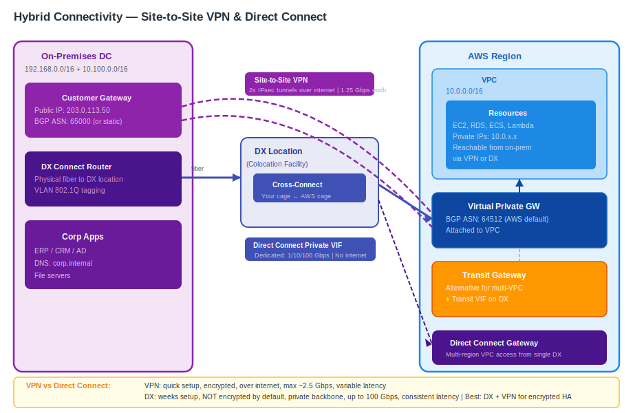

AWS provides two types of VPN for extending your network into a VPC.

### Site-to-Site VPN

Connects your **on-premises network or datacenter** to your VPC over IPsec tunnels through the internet.

**Components:**
- **Virtual Private Gateway (VGW)**: the AWS side of the VPN, attached to your VPC
- **Customer Gateway (CGW)**: represents your on-premises VPN device in AWS (stores its public IP and BGP ASN)
- **VPN Connection**: the logical connection between VGW and CGW, consisting of **2 IPsec tunnels** (for redundancy — each terminates in a different AWS AZ)

```
On-Premises Datacenter
┌─────────────────────────────────┐
│  Your Router / Firewall         │
│  (Customer Gateway: 203.x.x.x) │
└──────────────┬──────────────────┘
               │
      ┌────────┴────────┐
      │  Tunnel 1        │  ← IPsec/IKE over internet
      │  Tunnel 2        │  ← IPsec/IKE over internet (different AWS AZ)
      └────────┬────────┘
               │
┌──────────────┴──────────────────────────────────────────────┐
│  VPC                                                        │
│  ┌────────────────────────────┐                             │
│  │  Virtual Private Gateway   │                             │
│  │  (VGW — attached to VPC)  │                             │
│  └────────────────────────────┘                             │
└─────────────────────────────────────────────────────────────┘
```

**Routing options:**
- **Static routing**: you manually enter your on-premises CIDRs in the VPN connection
- **BGP (dynamic routing)**: VGW and CGW exchange routes automatically (recommended)

**Bandwidth:** ~1.25 Gbps max per tunnel (2.5 Gbps total with ECMP).

### AWS Client VPN

Allows **individual users** to securely access AWS resources and on-premises networks using an OpenVPN-based client.

- Users authenticate via Active Directory, SAML 2.0 IdP, or certificate-based auth
- Assigns each user a private IP from the client CIDR pool
- Subnet associations determine which VPC subnets clients can access
- Split-tunnel mode: only VPC-destined traffic goes through the VPN; internet traffic goes direct

```
User Laptop
(OpenVPN client)
      │
      │  TLS/OpenVPN over internet
      ▼
Client VPN Endpoint (ENIs in your VPC subnets)
      │
      ▼
VPC Resources (EC2, RDS, EKS…)
```

---

## 12. AWS Direct Connect (DX)

**AWS Direct Connect** provides a dedicated, private network connection from your datacenter to AWS — bypassing the public internet entirely for lower latency, consistent bandwidth, and reduced data transfer costs.

### Connection Types

| Type       | Speed Options               | Notes                              |
|------------|-----------------------------|------------------------------------|
| Dedicated  | 1 Gbps, 10 Gbps, 100 Gbps  | Physical port in a DX location     |
| Hosted     | 50 Mbps – 10 Gbps          | Provisioned by an AWS DX partner   |

### Physical Path

```
Your Datacenter
      │
      │  Your network (fiber)
      ▼
DX Location (colocation facility)
      │  Cross-connect to AWS cage
      ▼
AWS Direct Connect Router
      │  AWS private backbone
      ▼
AWS Region
```

### Virtual Interfaces (VIFs)

A VIF is a virtual layer-3 connection layered on top of the physical DX port.

| VIF Type     | Connects to        | Use case                                    |
|--------------|--------------------|---------------------------------------------|
| Private VIF  | Virtual Private GW | Access resources in a single VPC            |
| Public VIF   | AWS public network | Access AWS public services (S3, DynamoDB)   |
| Transit VIF  | Transit Gateway    | Access multiple VPCs via a single DX + TGW  |

### Direct Connect Gateway (DXGW)

A **DX Gateway** lets a single DX connection reach VPCs in multiple AWS Regions and multiple accounts — without needing a DX connection per region.

```
On-Prem Datacenter
      │
      │ DX Connection (10 Gbps)
      ▼
DX Location
      │
      ▼
Direct Connect Gateway
      ├──── Private VIF ──── VPC (us-east-1)
      ├──── Private VIF ──── VPC (eu-west-1)
      └──── Transit VIF ──── TGW (ap-southeast-1)
                              ├── VPC-A
                              └── VPC-B
```

### Encryption

DX is **not encrypted** by default. Options to add encryption:
1. **DX + Site-to-Site VPN**: run IPsec VPN over the DX connection (hardware VPN via VGW)
2. **MACsec**: Layer-2 encryption available on Dedicated 10G/100G connections

### Resilience Best Practices

| Level     | Setup                                                   |
|-----------|---------------------------------------------------------|
| High      | Two DX connections to two different DX locations        |
| Maximum   | Above + a Site-to-Site VPN as backup failover path      |
| Dev/Test  | Single DX + VPN backup                                  |

---

## 13. Elastic Network Interfaces (ENIs)

An **Elastic Network Interface (ENI)** is a logical networking component in a VPC that represents a virtual network card. Every EC2 instance has at least one ENI (the primary, `eth0`).

### ENI Attributes

Each ENI can have:
- One primary private IPv4 address
- One or more secondary private IPv4 addresses
- One Elastic IP per private IPv4
- One public IPv4 (ephemeral)
- One or more IPv6 addresses
- Up to 5 security groups
- A MAC address
- A source/destination check flag

### Primary vs Secondary ENIs

| Property               | Primary ENI (eth0)         | Secondary ENI (eth1…)        |
|------------------------|----------------------------|------------------------------|
| Deletable              | No (deleted with instance) | Yes                          |
| Detachable             | No                         | Yes (can move to another instance) |
| Created by             | AWS at launch              | You (manually or at launch)  |

### Dual-Homed Instance

Attach a secondary ENI from a different subnet to create an instance with interfaces in two subnets (e.g., a network appliance, firewall, or proxy):

```
┌───────────────────────────────────────────────────┐
│  EC2 Instance (e.g., firewall appliance)          │
│                                                   │
│  eth0 (10.0.1.10) ─── Public Subnet              │
│  eth1 (10.0.11.10) ── Private Subnet             │
└───────────────────────────────────────────────────┘
```

### ENI Failover Pattern

For fast failover without re-IP: pre-attach a secondary ENI to a standby instance. On failure, detach from primary and re-attach to standby. The Elastic IP follows the ENI — clients see no IP change.

---

## 14. Elastic IPs (EIPs)

An **Elastic IP (EIP)** is a static public IPv4 address allocated to your AWS account that you can associate with any EC2 instance or NAT Gateway in your VPC.

### Key Facts

- Allocated from AWS's public IPv4 pool (or from your BYOIP range)
- Persists independently of instances — survives stop/start cycles
- Moves between instances instantly (important for failover)
- **Charges**: free while associated with a running instance; **charged** (~$0.005/hr) when allocated but not associated (to discourage hoarding)
- Soft limit: 5 EIPs per region per account (requestable increase)

### Typical Use Cases

| Use Case                            | Why EIP                                     |
|-------------------------------------|---------------------------------------------|
| NAT Gateway                         | Required — must have a static public IP     |
| Bastion host                        | Stable IP to allowlist in firewalls         |
| Application failover                | Move EIP to standby instance in seconds     |
| DNS A record pointing to EC2        | Stable IP so DNS doesn't need updating      |

### EIP vs Auto-Assigned Public IP

| Feature                | Auto-assigned Public IP | Elastic IP           |
|------------------------|-------------------------|----------------------|
| Static                 | No (changes on stop)    | Yes                  |
| Survives stop/start    | No                      | Yes                  |
| Transferable           | No                      | Yes                  |
| Cost when associated   | Free                    | Free                 |
| Cost when unassociated | N/A                     | ~$0.005/hr           |

---

## 15. VPC Flow Logs

**VPC Flow Logs** capture metadata about IP traffic flowing through network interfaces in your VPC. Useful for security analysis, compliance, and troubleshooting connectivity issues.

### What Gets Captured

Flow logs record **accepted and rejected** traffic at the network level. Each log record is a flow (not a packet — it's an aggregation window of ~1–10 minutes).

**Default flow log record fields:**
```
version account-id interface-id srcaddr dstaddr srcport dstport protocol packets bytes windowstart windowend action log-status
```

**Example record (ACCEPT):**
```
2 123456789012 eni-abc12345 10.0.1.25 10.0.11.50 45892 5432 6 20 4000 1620000000 1620000060 ACCEPT OK
```

**Example record (REJECT — NACL or SG blocked):**
```
2 123456789012 eni-abc12345 203.0.113.5 10.0.1.25 54321 22 6 3 180 1620000000 1620000060 REJECT OK
```

### Capture Levels

| Level     | Captures traffic for                          |
|-----------|-----------------------------------------------|
| VPC       | All ENIs in the VPC                           |
| Subnet    | All ENIs in a specific subnet                 |
| ENI       | A single network interface                    |

### Destinations

| Destination              | Best for                                       |
|--------------------------|------------------------------------------------|
| CloudWatch Logs          | Real-time monitoring, metric filters, alarms   |
| Amazon S3                | Long-term storage, Athena queries, cost-efficient |
| Kinesis Data Firehose    | Real-time streaming to S3/OpenSearch/Splunk    |

### Custom Flow Log Format

You can choose which fields to include. Adding newer fields like `vpc-id`, `subnet-id`, `instance-id`, `tcp-flags`, `pkt-srcaddr`, `pkt-dstaddr` helps with advanced analysis.

### Cost Considerations

- Ingestion cost to CloudWatch Logs: ~$0.50/GB
- S3 storage: ~$0.023/GB/month
- For high-traffic VPCs, use S3 + Athena for cost-effective querying
- Consider filtering: capture only `REJECT` flows for security alerting

---

## 16. DNS in VPC

Every VPC gets a built-in DNS resolver provided by AWS — the **Amazon Route 53 Resolver** (accessible at the VPC base CIDR +2 address, e.g., `10.0.0.2`).

### VPC DNS Settings

Two critical settings on every VPC:

| Setting                | Description                                              | Default in custom VPC |
|------------------------|----------------------------------------------------------|-----------------------|
| `enableDnsSupport`     | Enables the Route 53 Resolver for the VPC                | true                  |
| `enableDnsHostnames`   | Assigns DNS hostnames to EC2 instances with public IPs   | false                 |

> Both must be `true` for EC2 instances to get public DNS hostnames like `ec2-54-x-x-x.compute-1.amazonaws.com`.

### Private Hosted Zones

You can attach a **Route 53 Private Hosted Zone** (PHZ) to your VPC. Resources in the VPC resolve names from the PHZ:

```
EC2 queries: db.internal.mycompany.com
  └── Route 53 Resolver (10.0.0.2) checks PHZ
  └── Returns: 10.0.21.15 (RDS instance private IP)
```

PHZs can be associated with multiple VPCs (including cross-account).

### Hybrid DNS with Route 53 Resolver Endpoints

When you have a hybrid environment, you need DNS to resolve:
- AWS resources from on-premises
- On-premises hostnames from within VPC

#### Inbound Endpoint
An ENI in your VPC that accepts DNS queries **from on-premises**:

```
On-prem DNS server
      │ query: app.internal.aws (forward rule)
      ▼
Inbound Resolver Endpoint (ENI: 10.0.11.53)
      │
      ▼
Route 53 Resolver → returns private IP of app.internal.aws
```

#### Outbound Endpoint
An ENI in your VPC that forwards DNS queries **to on-premises DNS**:

```
EC2 Instance
      │ query: server.corp.internal
      ▼
Route 53 Resolver → checks forwarding rules
      │ matches: *.corp.internal → forward to 192.168.1.53
      ▼
Outbound Resolver Endpoint (ENI: 10.0.11.54)
      │
      ▼
On-premises DNS (192.168.1.53)
      │
      ▼
Returns IP of server.corp.internal
```

### Full Hybrid DNS Diagram

```
┌──────────────────────────────────────────────────────────────────────────┐
│  AWS VPC                                                                 │
│                                                                          │
│  EC2: "resolve server.corp.internal"                                     │
│    │                                                                     │
│    ▼                                                                     │
│  Route 53 Resolver (10.0.0.2)                                            │
│    │  checks Resolver Rules                                              │
│    │  *.corp.internal → forward to 192.168.1.53 via Outbound Endpoint   │
│    ▼                                                                     │
│  Outbound Endpoint ENI ──────────────────────────────────────────────┐  │
└──────────────────────────────────────────────────────────────────────┼──┘
                         VPN / Direct Connect                          │
                                                                       ▼
                                                         On-Premises DNS
                                                         (192.168.1.53)
                                                                       │
                                                         Resolves and returns IP
```

---

## 17. High Availability & Multi-AZ Architecture

This section brings everything together into a production-ready, highly available VPC architecture — the canonical 3-tier pattern.

### Architecture Goals

- No single point of failure at the network layer
- Each tier isolated in its own subnet type
- AZ-independent: failure of one AZ doesn't take down the application
- Minimal blast radius per security boundary

### Complete Production VPC — ASCII Diagram

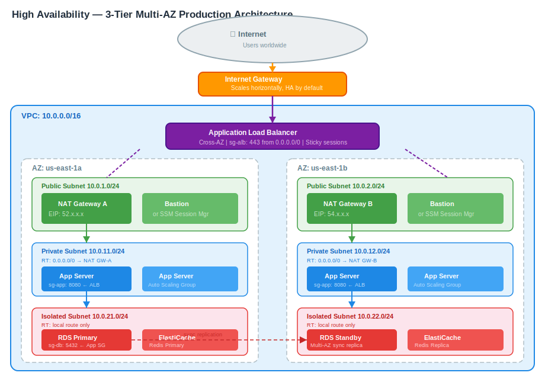

```
  ┌─────────────────────────────────────────────────────────────────────────────────┐
  │  AWS Region (e.g. us-east-1)                                                    │
  │  VPC: 10.0.0.0/16                                                               │
  │                                                                                 │
  │  ┌──────────────────────────────────────────────────────────────────────────┐   │
  │  │                       Internet Gateway (IGW)                             │   │
  │  └────────────────────────────────┬─────────────────────────────────────────┘   │
  │                                   │                                             │
  │  ┌──────────────────────────────┐ │ ┌──────────────────────────────────────┐    │
  │  │   AZ: us-east-1a             │ │ │   AZ: us-east-1b                     │    │
  │  │                              │ │ │                                      │    │
  │  │  ┌────────────────────────┐  │ │ │  ┌─────────────────────────────┐    │    │
  │  │  │  PUBLIC (10.0.1.0/24)  │◄─┘ └─►│  PUBLIC (10.0.2.0/24)       │    │    │
  │  │  │  ┌──────────────────┐  │       │  ┌──────────────────────┐    │    │    │
  │  │  │  │ ALB Node (AZ-A)  │  │       │  │ ALB Node (AZ-B)      │    │    │    │
  │  │  │  └──────────────────┘  │       │  └──────────────────────┘    │    │    │
  │  │  │  ┌──────────────────┐  │       │  ┌──────────────────────┐    │    │    │
  │  │  │  │  NAT Gateway A   │  │       │  │  NAT Gateway B       │    │    │    │
  │  │  │  │  EIP: 52.x.x.x   │  │       │  │  EIP: 54.x.x.x       │    │    │    │
  │  │  │  └──────────────────┘  │       │  └──────────────────────┘    │    │    │
  │  │  └────────────────────────┘       └─────────────────────────────┘    │    │
  │  │                                                                        │    │
  │  │  ┌────────────────────────┐       ┌─────────────────────────────┐     │    │
  │  │  │  PRIVATE (10.0.11.0/24)│       │  PRIVATE (10.0.12.0/24)     │     │    │
  │  │  │  ┌──────────────────┐  │       │  ┌──────────────────────┐   │     │    │
  │  │  │  │  App Server A1   │  │       │  │  App Server B1        │   │     │    │
  │  │  │  │  App Server A2   │  │       │  │  App Server B2        │   │     │    │
  │  │  │  └──────────────────┘  │       │  └──────────────────────┘   │     │    │
  │  │  │  Route: 0.0.0.0/0 →   │       │  Route: 0.0.0.0/0 →        │     │    │
  │  │  │    NAT GW-A            │       │    NAT GW-B                 │     │    │
  │  │  └────────────────────────┘       └─────────────────────────────┘     │    │
  │  │                                                                        │    │
  │  │  ┌────────────────────────┐       ┌─────────────────────────────┐     │    │
  │  │  │ ISOLATED (10.0.21.0/24)│       │ ISOLATED (10.0.22.0/24)     │     │    │
  │  │  │  ┌──────────────────┐  │       │  ┌──────────────────────┐   │     │    │
  │  │  │  │  RDS Primary     │  │  ───► │  │  RDS Standby (Multi- │   │     │    │
  │  │  │  │  (PostgreSQL)    │  │       │  │  AZ Replica)         │   │     │    │
  │  │  │  └──────────────────┘  │       │  └──────────────────────┘   │     │    │
  │  │  │  No internet route     │       │  No internet route           │     │    │
  │  │  └────────────────────────┘       └─────────────────────────────┘     │    │
  │  └──────────────────────────────────────────────────────────────────────┘    │
  └─────────────────────────────────────────────────────────────────────────────────┘

Security Groups:
  sg-alb:  inbound 80/443 from 0.0.0.0/0
  sg-app:  inbound 8080 from sg-alb only
  sg-db:   inbound 5432 from sg-app only
```

### Traffic Flow (User Request)

```
User Browser
    │ HTTPS to ALB DNS
    ▼
Route 53 → ALB DNS → ALB (distributes across AZ-A and AZ-B nodes)
    │
    ▼
ALB → forwards to App Server (in Private Subnet, any AZ)
    │
    ▼
App Server → queries RDS endpoint → RDS Primary (Isolated Subnet AZ-A)
    │                               (RDS handles failover to AZ-B if needed)
    ▼
Response flows back through ALB → User
```

### SSM Session Manager vs Bastion Host

Traditional bastion hosts require an open SSH port. Use **AWS Systems Manager Session Manager** instead:

| Feature                     | Bastion Host         | SSM Session Manager    |
|-----------------------------|----------------------|------------------------|
| Open inbound SSH port       | Yes (port 22)        | No                     |
| Requires public IP          | Yes                  | No                     |
| Audit logging               | Manual setup         | Built-in (CloudTrail)  |
| IAM-controlled access       | Partial              | Full                   |
| Cost                        | EC2 instance cost    | Free (interface endpoint optional) |

---

## 18. CIDR Planning Cheat Sheet

Good IP planning prevents painful future re-architectures. Plan for 3-5x your current scale.

### RFC 1918 Private Address Ranges

| Range               | Hosts Available       | Common use            |
|---------------------|-----------------------|-----------------------|
| 10.0.0.0/8          | ~16.7 million         | Enterprise / AWS VPCs |
| 172.16.0.0/12       | ~1 million            | Mid-size networks     |
| 192.168.0.0/16      | ~65,000               | Small / home networks |

### VPC CIDR Sizing

| VPC CIDR   | Total IPs | Usable (approx) | Good for                          |
|------------|-----------|-----------------|-----------------------------------|
| /16        | 65,536    | ~65,000         | Large production VPCs             |
| /17        | 32,768    | ~32,000         | Medium production VPCs            |
| /20        | 4,096     | ~4,000          | Small workload VPC                |
| /24        | 256       | 251             | Tiny VPC (not recommended)        |

> Use `/16` for every production VPC. Future subnetting flexibility is worth the address space.

### Subnet Sizing Reference

| Subnet CIDR | Total IPs | Usable IPs | Typical use                            |
|-------------|-----------|------------|----------------------------------------|
| /24         | 256       | 251        | General subnets                        |
| /25         | 128       | 123        | Smaller tier subnets                   |
| /26         | 64        | 59         | Small service subnets                  |
| /27         | 32        | 27         | TGW attachments, VPN endpoints         |
| /28         | 16        | 11         | Interface endpoint subnets, minimal    |

### Recommended Layout for a Production VPC (10.0.0.0/16)

```
VPC: 10.0.0.0/16

Public Subnets (one per AZ):
  10.0.1.0/24   AZ-A
  10.0.2.0/24   AZ-B
  10.0.3.0/24   AZ-C

Private / App Subnets:
  10.0.11.0/24  AZ-A
  10.0.12.0/24  AZ-B
  10.0.13.0/24  AZ-C

Isolated / DB Subnets:
  10.0.21.0/24  AZ-A
  10.0.22.0/24  AZ-B
  10.0.23.0/24  AZ-C

Reserved for future use:
  10.0.100.0/22  (management, VPN endpoints, endpoints)
  10.0.200.0/22  (future expansion)
```

### Multi-VPC CIDR Strategy (no overlapping!)

When planning multiple VPCs that might ever be peered or connected through TGW:

```
Production VPC:    10.0.0.0/16
Staging VPC:       10.1.0.0/16
Development VPC:   10.2.0.0/16
Shared Services:   10.3.0.0/16
Management VPC:    10.4.0.0/16
On-premises DC:    192.168.0.0/16  (pre-assigned, don't overlap)
```

Using `/16` per VPC in the `10.x.0.0` space gives you 256 distinct VPCs before you run out — ample for most organizations.

---

---

## 19. Prefix Lists

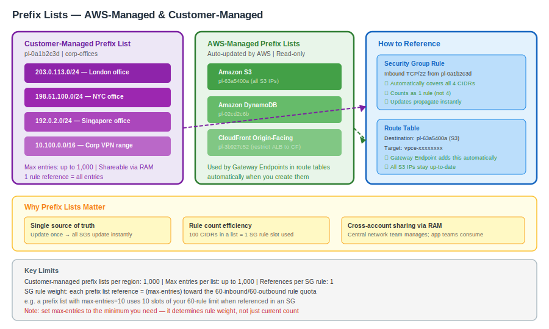

A **Prefix List** is a named set of CIDR blocks that can be referenced in security group rules and route tables — replacing repeated, hard-to-maintain IP lists with a single managed object.

### AWS-Managed Prefix Lists

AWS maintains prefix lists for its own services. You cannot edit them — they update automatically as AWS adds IPs.

| Name                             | ID (us-east-1)    | Use case                              |
|----------------------------------|-------------------|---------------------------------------|
| Amazon S3                        | pl-63a5400a       | Allow SG/route traffic to S3          |
| Amazon DynamoDB                  | pl-02cd2c6b       | Allow SG/route traffic to DynamoDB    |
| Amazon CloudFront (origin-facing)| pl-3b927c52       | Restrict ALB to CloudFront IPs only   |

These are the same prefix lists that Gateway Endpoints insert into your route table.

### Customer-Managed Prefix Lists

You create and maintain these yourself — useful for:
- A shared list of your corporate office IP ranges referenced across many SGs
- A list of trusted partner CIDRs maintained in one place
- Reducing SG rule count (1 prefix list reference = 1 rule, regardless of how many CIDRs it contains)

**Creating a prefix list:**
```
aws ec2 create-managed-prefix-list \
  --prefix-list-name "corp-offices" \
  --max-entries 10 \
  --address-family IPv4

# Add entries
aws ec2 modify-managed-prefix-list \
  --prefix-list-id pl-xxxxxxxxx \
  --add-entries Cidr=203.0.113.0/24,Description="London office" \
  --add-entries Cidr=198.51.100.0/24,Description="NYC office"
```

**Referencing in a Security Group rule:**
```
aws ec2 authorize-security-group-ingress \
  --group-id sg-xxxxxxxxx \
  --ip-permissions IpProtocol=tcp,FromPort=22,ToPort=22,\
    PrefixListIds=[{PrefixListId=pl-xxxxxxxxx}]
```

**Key limits:**
- Max 1,000 customer-managed prefix lists per region
- Max entries per list: configurable up to 1,000
- Each prefix list reference in an SG counts as 1 rule (regardless of list size)
- Prefix lists can be **shared via AWS RAM** to other accounts

---

## 20. AWS Network Firewall

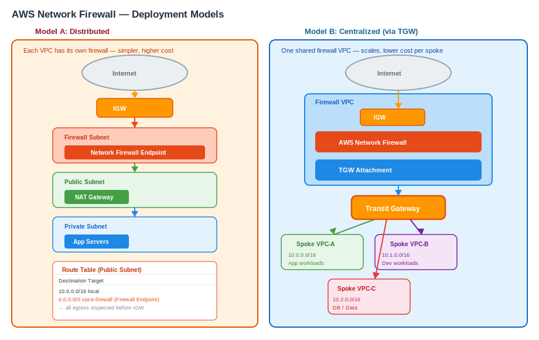

**AWS Network Firewall** is a managed, stateful network firewall and intrusion prevention service for VPCs. It sits inline in your traffic path and provides deep packet inspection beyond what Security Groups and NACLs offer.

### Capabilities vs SG / NACL

| Feature                    | Security Group | NACL        | Network Firewall         |
|----------------------------|----------------|-------------|--------------------------|
| Layer                      | L4             | L3/L4       | L3–L7                    |
| Stateful                   | Yes            | No          | Yes (optional)           |
| Domain/URL filtering       | No             | No          | Yes                      |
| Protocol detection         | No             | No          | Yes                      |
| IPS/IDS signatures         | No             | No          | Yes (managed rule groups)|
| TLS inspection             | No             | No          | Yes                      |
| Centralized management     | Per VPC        | Per VPC     | Cross-VPC via TGW        |

### Rule Groups

**Stateless rule groups** — evaluated first, no session tracking:
- Match on src/dst IP, port, protocol
- Actions: pass, drop, forward to stateful

**Stateful rule groups** — Suricata-compatible rules with session awareness:
- Domain list rules: allow/deny by FQDN (e.g., block `*.malware.com`)
- Standard 5-tuple rules with stateful tracking
- Suricata IPS rules: use AWS-managed threat intelligence rule groups

### Deployment Models

**Distributed** — one firewall per VPC (simple, no extra routing):
```
Internet → IGW → Firewall Endpoint → Public Subnet → App
```

**Centralized** — one firewall VPC, all spoke VPCs route through it via TGW:
```
Spoke VPC-A ─┐
Spoke VPC-B ─┤── TGW ──► Firewall VPC (Network Firewall) ──► IGW
Spoke VPC-C ─┘
```

**Combined** — distributed for east-west, centralized for north-south.

### Key Facts
- Deployed into a **dedicated firewall subnet** per AZ
- Firewall Endpoint is referenced in route tables (like a NAT GW)
- Logs (flow, alert) go to S3, CloudWatch Logs, or Kinesis Firehose
- Pricing: ~$0.395/hr per AZ + $0.065/GB processed

---

## 21. Gateway Load Balancer (GWLB)

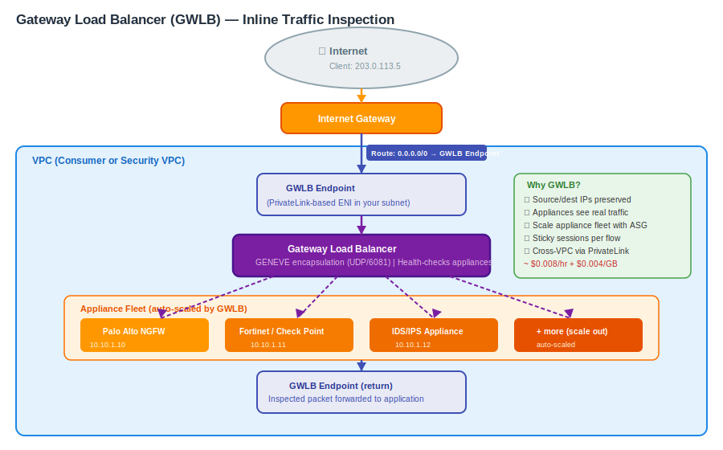

**Gateway Load Balancer** lets you deploy, scale, and manage third-party network virtual appliances (firewalls, IDS/IPS, deep packet inspection tools) inline in your traffic path — transparently, without changing routing in spoke VPCs.

### How It Works

GWLB uses the **GENEVE protocol (port 6081)** to encapsulate packets and forward them to appliance instances, then return them to their original destination — completely transparent to the source and destination.

```
Client (internet)
      │
      ▼
IGW
      │  (route table: 0.0.0.0/0 → GWLB Endpoint)
      ▼
GWLB Endpoint (in your VPC — acts like a bump-in-the-wire)
      │  GENEVE encapsulation
      ▼
GWLB  ──── scales appliance fleet (Palo Alto, Fortinet, Check Point…)
      │  inspected + returned
      ▼
GWLB Endpoint
      │
      ▼
Application (EC2 / ALB)
```

### Key Properties
- **Transparent**: source/destination IPs are preserved through the appliance
- **Scales**: GWLB health-checks appliances and load-balances across them
- **Cross-VPC**: GWLB Endpoint (PrivateLink-based) lets spoke VPCs send traffic to a centralized appliance VPC
- Supports **sticky sessions** — same flow always goes to the same appliance (important for stateful firewalls)
- Pricing: ~$0.008/hour per GWLB + $0.004/GB

### Use Cases
| Use case | How GWLB helps |
|----------|---------------|
| Third-party NGFW inline | Deploy Palo Alto / Fortinet / Check Point at scale |
| IDS/IPS without agents | Mirror all traffic through inspection appliance |
| Compliance inspection | Guaranteed all traffic inspected before reaching app |
| Centralized security VPC | One appliance fleet serving many spoke VPCs via TGW |

---

## 22. Traffic Mirroring

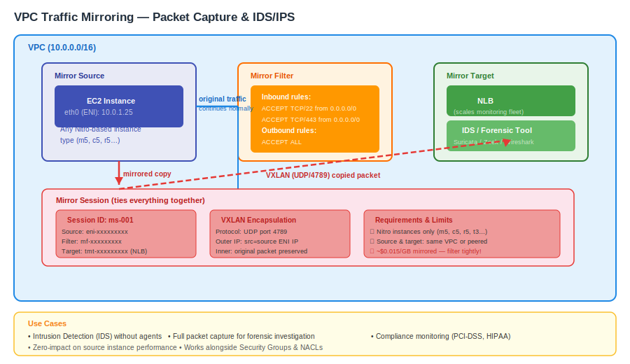

**VPC Traffic Mirroring** copies inbound and outbound traffic from an ENI and sends it to a monitoring appliance — without affecting the original traffic flow. Used for intrusion detection, packet capture, and network forensics.

### Components

| Component        | What it is                                                    |
|------------------|---------------------------------------------------------------|
| Mirror Source    | The ENI whose traffic you want to capture                     |
| Mirror Target    | Destination: another ENI or a Network Load Balancer           |
| Mirror Filter    | Rules specifying which traffic to mirror (src/dst, port, protocol) |
| Mirror Session   | Ties source + target + filter together, with a priority       |

### Traffic Flow

```
EC2 Instance (source ENI)
      │
      ├──── original traffic continues normally ────► destination
      │
      └──── mirrored copy (VXLAN encapsulated, UDP 4789) ──► Mirror Target
                                                              (IDS appliance / NLB)
```

Mirrored packets are **VXLAN-encapsulated** — your monitoring tool must be able to decapsulate VXLAN (most modern IDS/IPS tools do).

### Filter Examples

```
# Mirror only inbound SSH attempts
Direction: INGRESS
Protocol: TCP
Destination port: 22
Action: ACCEPT

# Mirror all traffic except internal VPC traffic
Direction: ALL
Source CIDR: 0.0.0.0/0
Destination CIDR: 10.0.0.0/8
Action: REJECT   ← exclude internal
```

### Key Facts
- Source and target must be in the **same VPC** or connected via VPC peering / TGW
- Supported on **Nitro-based instances** only (most current-gen types)
- NLB as target allows horizontal scaling of monitoring appliances
- Pricing: ~$0.015/GB of mirrored traffic
- Does **not** affect latency or throughput of the source instance

---

## 23. VPC Lattice

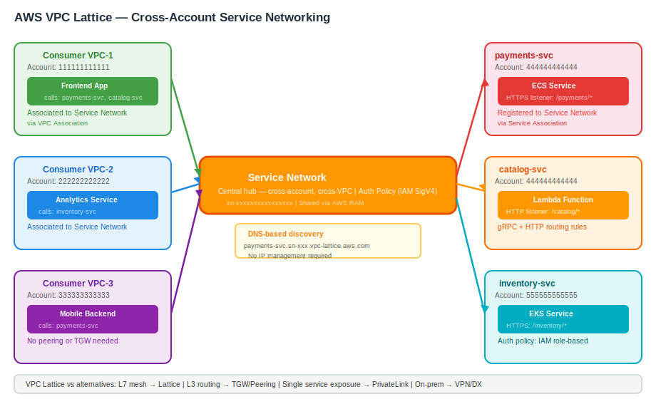

**AWS VPC Lattice** (GA 2023) is an application networking service that simplifies service-to-service communication across VPCs and accounts — without requiring VPC peering, TGW, or per-service PrivateLink configurations.

### Core Concepts

| Concept            | Description                                                          |
|--------------------|----------------------------------------------------------------------|
| **Service Network**| A logical boundary grouping services and their consumers            |
| **Service**        | Your application (EC2, ECS, EKS, Lambda) with listener rules        |
| **Service Directory**| Centrally discover all services in your organization              |
| **Auth Policy**    | IAM-based access control on the service network or individual service|
| **Association**    | Links a VPC or service to a service network                         |

### Architecture

```
Account A — Consumer VPCs                  Account B — Provider Services
┌────────────────────────────┐            ┌──────────────────────────────────┐
│  VPC-1 (associated)        │            │  Service: payments-svc           │
│  ┌─────────────────────┐   │            │  (ECS behind ALB/Lambda)         │
│  │  App (calls         │   │            └──────────────────────────────────┘
│  │  payments-svc.vpc-  │   │
│  │  lattice.aws.com)   │   │            ┌──────────────────────────────────┐
│  └─────────────────────┘   │            │  Service: inventory-svc          │
└────────────────────────────┘            │  (EKS)                           │
                                          └──────────────────────────────────┘
         │                                              │
         └──────────── Service Network ────────────────┘
                       (central hub — cross-account, cross-VPC)
```

### VPC Lattice vs Alternatives

| Scenario                               | Best choice             |
|----------------------------------------|-------------------------|
| L7 service mesh, cross-account         | VPC Lattice             |
| Simple VPC-to-VPC L3 routing           | VPC Peering / TGW       |
| Expose one service to many consumers   | PrivateLink             |
| Full network-level isolation required  | TGW with separate RT    |
| On-prem to VPC connectivity            | VPN / Direct Connect    |

### Key Facts
- Supports **HTTP, HTTPS, gRPC** listeners with path/header/method routing rules
- Auth policies use **AWS SigV4** — services authenticate with IAM roles
- Built-in **observability**: access logs, CloudWatch metrics per service
- No IP management, no CIDR planning required — purely DNS-based
- Pricing: ~$0.025/hr per service network + $0.0025/1,000 requests + $0.025/GB

---

## 24. Enhanced Networking & MTU

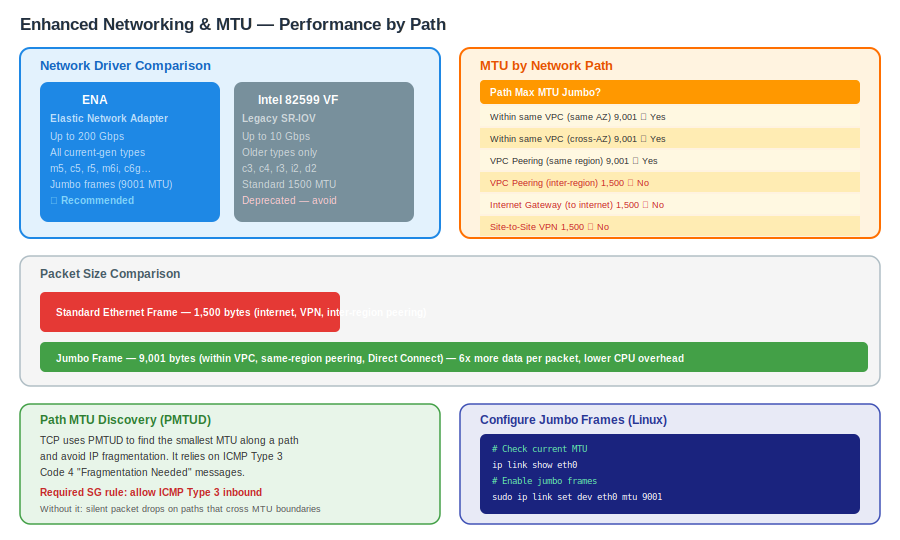

Network performance within a VPC depends on the instance type, network driver, and MTU configuration. Getting these right matters for high-throughput or latency-sensitive workloads.

### Enhanced Networking

AWS supports two enhanced networking technologies:

| Technology              | Driver       | Max Bandwidth  | Supported instances         |
|-------------------------|--------------|----------------|-----------------------------|
| **ENA** (Elastic Network Adapter) | `ena` | Up to 200 Gbps | All current-gen (m5, c5, r5, m6i…) |
| **Intel 82599 VF** (legacy SR-IOV) | `ixgbevf` | Up to 10 Gbps | Older types (c3, c4, r3, i2…) |

**ENA is the standard** for all instances launched after 2016. It provides:
- Up to 200 Gbps aggregate bandwidth (on `u-*` / `trn1` / `p4d` instances)
- Low-latency packet processing in hardware (bypasses hypervisor)
- Jumbo frame support (up to 9,001 bytes MTU)

Check if ENA is enabled:
```bash
aws ec2 describe-instances --instance-id i-xxxxxxxxx \
  --query 'Reservations[].Instances[].EnaSupport'
# Should return: true
```

### MTU and Jumbo Frames

**MTU (Maximum Transmission Unit)** is the largest packet size a network path can carry without fragmentation.

| Path                                         | Max MTU     | Notes                              |
|----------------------------------------------|-------------|------------------------------------|
| Within the same VPC (same AZ)               | 9,001 bytes | Jumbo frames — full throughput     |
| Within the same VPC (cross-AZ)              | 9,001 bytes | Jumbo frames supported             |
| VPC Peering (same region)                   | 9,001 bytes | Jumbo frames supported             |
| VPC Peering (inter-region)                  | 1,500 bytes | No jumbo frames across regions     |
| Internet Gateway (to internet)              | 1,500 bytes | Internet standard MTU              |
| Site-to-Site VPN                            | 1,500 bytes | IPsec overhead reduces effective MTU|
| Direct Connect                              | 9,001 bytes | Jumbo frames supported             |
| Transit Gateway                             | 8,500 bytes | Slightly below full jumbo          |

### Path MTU Discovery (PMTUD)

TCP uses PMTUD to detect the smallest MTU along a path and avoid fragmentation. This relies on ICMP Type 3 Code 4 ("Fragmentation Needed") packets being allowed through security groups.

> **Best practice:** Allow ICMP Type 3 (Destination Unreachable) in your security groups to ensure PMTUD works correctly, especially on paths that cross MTU boundaries (e.g., VPC → VPN → on-prem).

### Setting Jumbo Frames on Linux

```bash
# Check current MTU
ip link show eth0

# Set jumbo frames (within VPC only)
sudo ip link set dev eth0 mtu 9001

# Persist across reboots (Amazon Linux 2 / AL2023)
echo 'MTU=9001' >> /etc/sysconfig/network-scripts/ifcfg-eth0
```

---

## 25. VPC Sharing via RAM

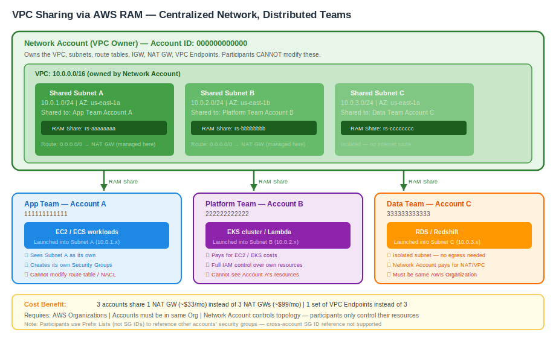

**VPC Sharing** (using AWS Resource Access Manager) lets the VPC owner share **subnets** with other AWS accounts in the same AWS Organization — allowing multiple accounts to launch resources into a centrally managed VPC without each account needing its own VPC.

### How It Works

```
Network Account (VPC Owner)
┌────────────────────────────────────────────────────────┐
│  VPC: 10.0.0.0/16                                      │
│  ┌──────────────────┐   ┌──────────────────────────┐  │
│  │ Shared Subnet A  │   │ Shared Subnet B          │  │
│  │ 10.0.1.0/24      │   │ 10.0.2.0/24              │  │
│  └────────┬─────────┘   └────────────┬─────────────┘  │
└───────────┼─────────────────────────-┼────────────────-┘
            │ RAM Share                │ RAM Share
            ▼                          ▼
   App Team Account A          Platform Team Account B
   (launches EC2, RDS          (launches EKS, Lambda
    into Subnet A)              into Subnet B)
```

### Owner vs Participant

| Responsibility          | VPC Owner (Network Acct) | Participant (App Acct)       |
|-------------------------|--------------------------|------------------------------|
| VPC, subnets, IGW, NAT  | Creates and manages      | Cannot modify                |
| Route tables, NACLs     | Creates and manages      | Cannot modify                |
| Security Groups         | Can create in shared VPC | Creates their own SGs        |
| EC2, RDS, ECS resources | Cannot see/manage        | Launches and owns            |
| Billing                 | VPC/networking costs     | Resource (EC2, RDS) costs    |

### VPC Sharing vs Alternatives

| Approach          | Complexity | IP management | Cross-account | Best for                        |
|-------------------|------------|---------------|---------------|---------------------------------|
| VPC Sharing (RAM) | Low        | Centralized   | Yes           | Shared platform, cost efficiency|
| VPC Peering       | Medium     | Distributed   | Yes           | Isolated teams, simple 1:1      |
| Transit Gateway   | Medium     | Distributed   | Yes           | Many VPCs, hybrid, complex mesh |
| PrivateLink       | Medium     | N/A           | Yes           | Service exposure only (L7)      |

### Key Facts
- Participants **see and use** shared subnets as if they owned them
- Security groups created by participants are **account-scoped** — other accounts cannot reference them by ID (use prefix lists instead)
- Shared VPC reduces the number of VPCs to manage — fewer NAT Gateways, fewer VPC endpoints, lower overall cost
- Requires accounts to be in the same **AWS Organization** (or explicitly invited)
- The VPC owner can revoke sharing at any time — participants' resources in shared subnets continue running but cannot launch new ones

---

## Quick Reference — Service Limits

| Resource                          | Default Limit       |
|-----------------------------------|---------------------|
| VPCs per region                   | 5                   |
| Subnets per VPC                   | 200                 |
| Route tables per VPC              | 200                 |
| Routes per route table            | 50 (1000 with propagation) |
| Security groups per VPC           | 2,500               |
| Rules per security group          | 60 inbound + 60 outbound |
| NACLs per VPC                     | 200                 |
| Rules per NACL                    | 20 (each direction) |
| Internet gateways per region      | 5                   |
| NAT Gateways per AZ               | 5                   |
| EIPs per region                   | 5                   |
| VPC peering connections per VPC   | 50                  |

> All limits above are **soft limits** (requestable via AWS Support).

---

## Summary

| Component            | Layer        | Purpose                                              |
|----------------------|--------------|------------------------------------------------------|
| VPC                  | L3 network   | Isolated private network slice in AWS                |
| Subnet               | L3 segment   | AZ-scoped IP range within VPC                        |
| Route Table          | L3 routing   | Controls where traffic is forwarded                  |
| IGW                  | L3 gateway   | Internet access for public subnet resources          |
| NAT Gateway          | L4 NAT       | Outbound internet for private subnet resources       |
| Security Group       | L4 stateful  | Instance-level allow rules                           |
| NACL                 | L3/4 stateless | Subnet-level allow/deny rules                      |
| Prefix List          | L3 addressing | Named reusable CIDR set for SGs and route tables    |
| VPC Endpoint         | L3 private   | Private access to AWS services (no internet)         |
| PrivateLink (Svc)    | L4 private   | Publish your own service to other VPCs/accounts      |
| VPC Peering          | L3 routing   | Private 1:1 VPC connectivity                         |
| Transit Gateway      | L3 hub       | Multi-VPC + hybrid hub-and-spoke routing             |
| Site-to-Site VPN     | L3 IPsec     | Encrypted on-prem to VPC over internet               |
| Direct Connect       | L1/L2 dedicated | Private physical link to AWS                      |
| Network Firewall     | L3–L7        | Managed stateful firewall + IPS for VPC traffic      |
| Gateway Load Balancer| L3 transparent | Inline scaling of 3rd-party network appliances     |
| Traffic Mirroring    | Monitoring   | Copy ENI traffic to IDS/IPS/forensic tools           |
| VPC Lattice          | L7 service mesh | Cross-account/VPC service-to-service networking  |
| ENI                  | L2 vNIC      | Virtual network card for EC2 and services            |
| Elastic IP           | L3 addressing | Static public IPv4 address                          |
| Flow Logs            | Monitoring   | Traffic metadata capture for analysis                |
| Route 53 Resolver    | DNS          | VPC-internal DNS with hybrid forwarding              |
| ENA / Enhanced Net   | L2 hardware  | High-throughput, low-latency instance networking     |
| VPC Sharing (RAM)    | L3 multi-acct | Share subnets across AWS accounts in an Org         |
